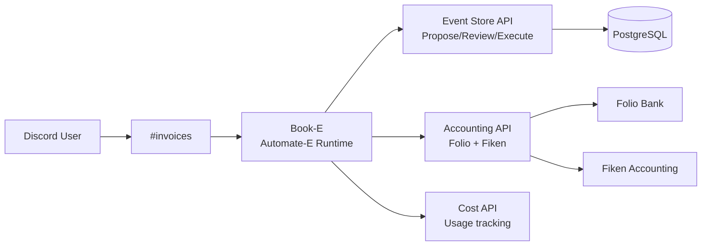
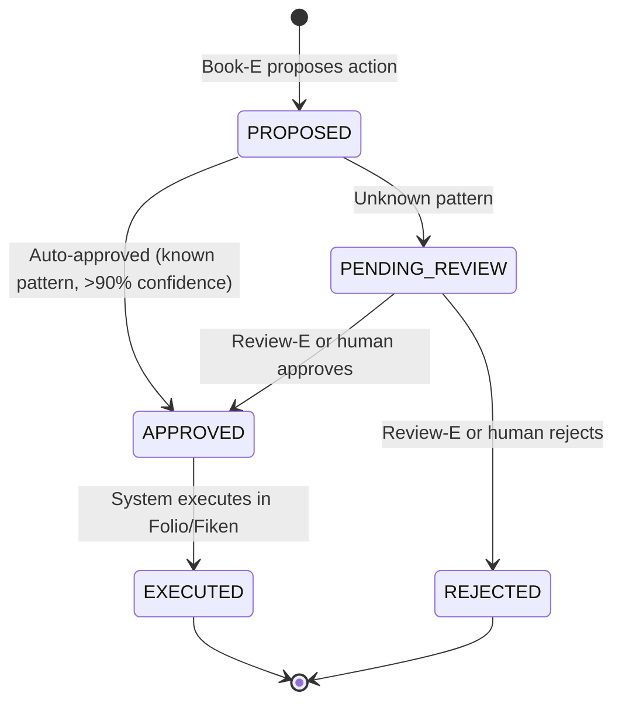

# Book-E

Book-E is the first agent built on the Automate-E runtime. It is an AI accounting assistant for Invotek AS that processes receipts, invoices, and expenses via Discord.

## What It Does

| Capability | How |
|-----------|-----|
| **Receipt processing** | User forwards a receipt in `#invoices`. Book-E extracts amount, merchant, VAT rate, and proposes an action. |
| **Invoice registration** | Proposes invoice entries in Fiken with account codes. |
| **Expense tracking** | Categorizes expenses with Norwegian bookkeeping rules. |
| **Balance queries** | Reads Folio account balances on demand. |
| **Cost monitoring** | Reports AI and cloud service spending via the Cost API. |

## Architecture

## Proposal Flow

Book-E does not execute actions directly. All write operations go through an event-sourced proposal flow:

## Tool APIs

Book-E has access to three backend services:

### Event Store API

| Method | Path | Purpose |
|--------|------|---------|
| `POST` | `/propose/receipt` | Propose receipt attachment |
| `POST` | `/propose/invoice` | Propose invoice registration |
| `POST` | `/propose/expense` | Propose expense registration |
| `GET` | `/events` | List events by status or correlationId |

### Accounting API

| Method | Path | Purpose |
|--------|------|---------|
| `GET` | `/folio/balance` | Folio account balances |
| `GET` | `/folio/transactions` | Folio transactions with attachments |
| `GET` | `/folio/missing-receipts` | Transactions missing receipts |
| `GET` | `/fiken/invoices` | Fiken invoices |
| `GET` | `/fiken/expenses` | Fiken expenses |

### Cost API

| Method | Path | Purpose |
|--------|------|---------|
| `GET` | `/usage/summary` | Total spending across all services |
| `GET` | `/usage/anthropic` | Anthropic API usage and costs |
| `GET` | `/usage/cloudflare` | Cloudflare usage and costs |

## Configuration

Book-E uses Claude Haiku for cost efficiency (most accounting tasks are pattern matching, not reasoning):

| Setting | Value |
|---------|-------|
| Model | `claude-haiku-4-5-20251001` |
| Temperature | 0.3 |
| Language | Norwegian |
| Channel | `#invoices` |
| Thread mode | `per-document` |
| Conversation retention | 30 days |
| Pattern retention | Indefinite |
| History retention | 5 years (bokforingsloven compliance) |

## Deployment

Book-E runs as a single-replica Deployment in the `ai-accountant` namespace. The character config is mounted from a ConfigMap. See [Deployment](../deployment.md) for the full manifest.

| Resource | Name |
|----------|------|
| Deployment | `book-e` |
| ConfigMap | `book-e-character` |
| SealedSecret | `book-e-secrets` |
| SealedSecret | `book-e-db` |
| Image | `ghcr.io/stig-johnny/automate-e:<sha>` |
