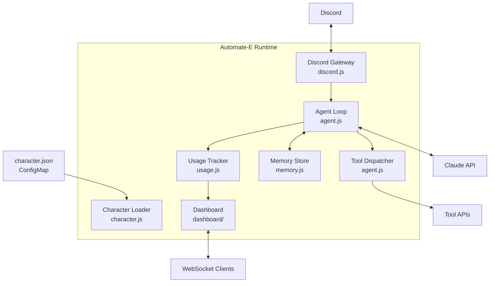
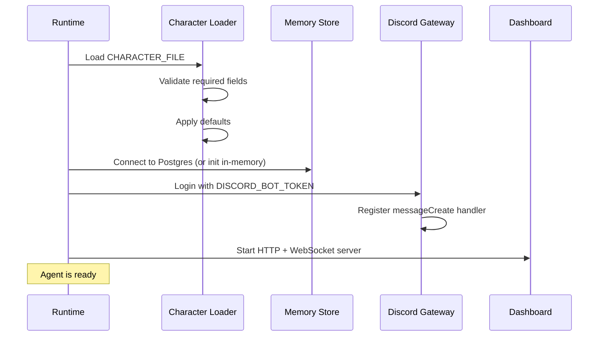
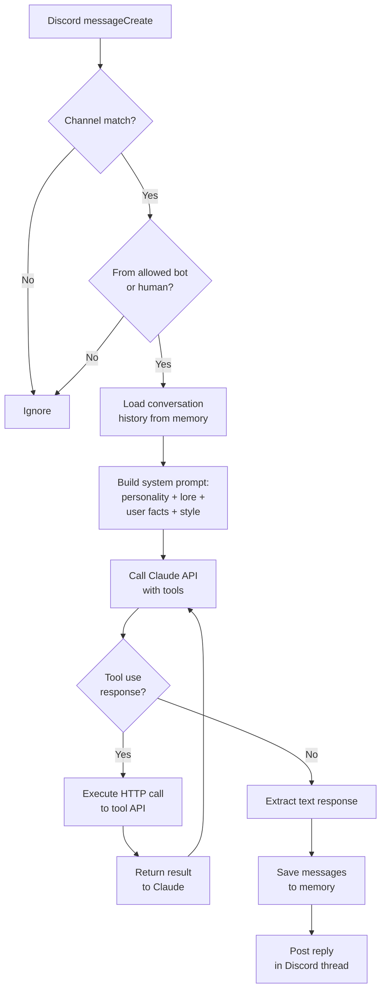

# Architecture

How the Automate-E runtime turns a `character.json` into a running Discord agent.

## Component Overview



## Startup Sequence



## Message Processing

When a Discord message arrives, the runtime processes it through these stages:



## Key Design Decisions

### Tool Calling via HTTP

Tools are HTTP endpoints, not code plugins. This means:

- Agents can call any REST API without runtime changes
- Tool definitions are pure configuration (no code deployment)
- APIs can be written in any language
- Tools are independently scalable Kubernetes services

### Character as Configuration

The entire agent personality and behavior is defined in `character.json`:

- No agent-specific code in the runtime
- Multiple agents share the same runtime image
- Character changes deploy via ConfigMap update (no image rebuild)
- Version control and review for personality changes

### Memory Layers

The memory system has three layers:

| Layer | Scope | Retention | Purpose |
|-------|-------|-----------|---------|
| Conversations | Per thread | Configurable (default 30d) | Context for ongoing conversations |
| Facts | Per user | Indefinite | Learned preferences and patterns |
| Patterns | Per entity (e.g., merchant) | Indefinite | Auto-approval confidence scores |

### Agent Loop Constraints

- Maximum 5 tool calls per message (prevents runaway loops)
- Each tool call is an independent HTTP request
- The agent loop is synchronous per message (no parallel tool calls)
- Failed tool calls return error text to Claude (does not crash the loop)

## File Structure

```
automate-e/
  src/
    index.js          # Entry point, startup orchestration
    character.js      # Loads and validates character.json
    agent.js          # Agent loop, tool dispatch, prompt building
    memory.js         # Postgres + in-memory storage
    usage.js          # Token counting and cost calculation
    dashboard/
      server.js       # HTTP server + WebSocket
      index.html      # Dashboard UI
  Dockerfile
  package.json
```
