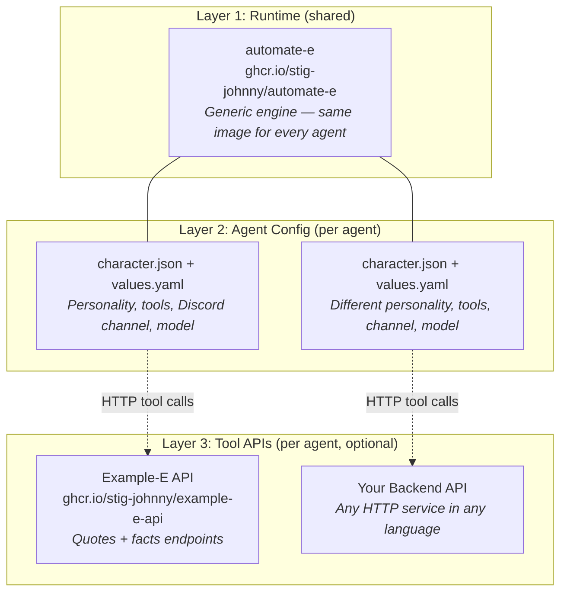
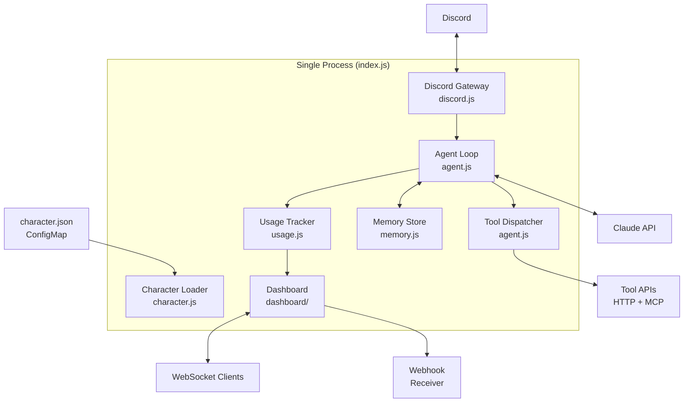
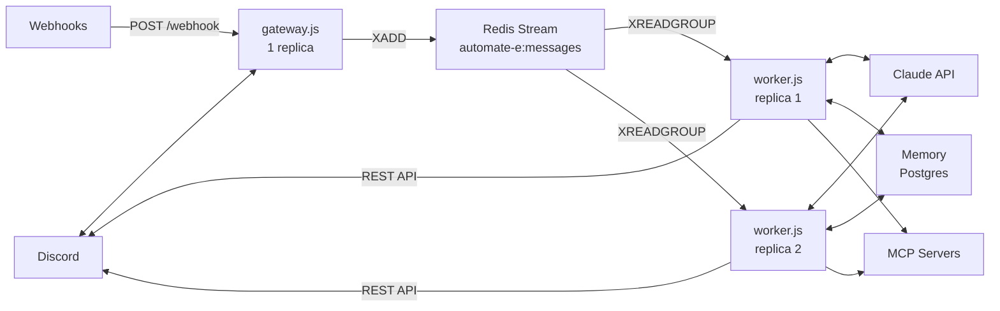
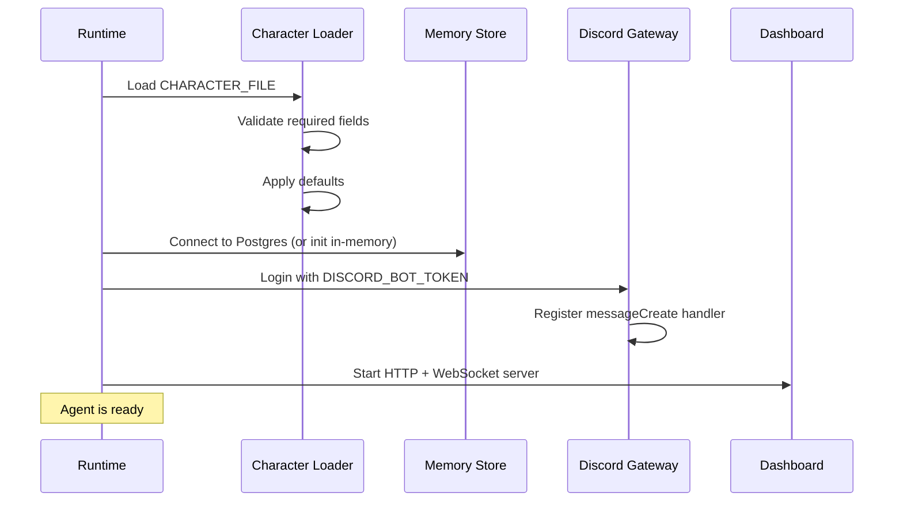
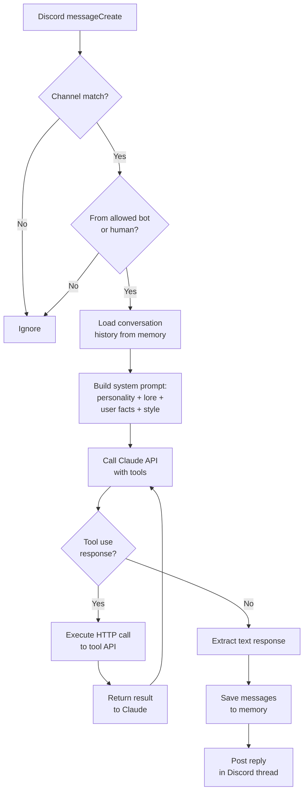

# Architecture

How the Automate-E runtime turns a `character.json` into a running Discord agent.

## Runtime vs Agent vs Tool APIs

Automate-E has three distinct layers. Understanding this separation is key to deploying your own agents.



### Layer 1: Runtime (this repo)

The Automate-E runtime is a **generic engine**. It handles Discord connectivity, the Claude agent loop, memory, and the dashboard. It reads a `character.json` at startup to know who it is and what it can do. The runtime image (`ghcr.io/stig-johnny/automate-e`) is **shared by all agents** — you never need to rebuild it for a new agent.

### Layer 2: Agent Configuration (your config)

Each agent is defined by a `character.json` file and a `values.yaml` for Helm. This is where you set the agent's personality, which Discord channels it listens on, which tools it can call, and which Claude model to use. Deploying a new agent means creating a new Helm release of the same chart with different values — no code changes required.

### Layer 3: Tool APIs (your backend, optional)

Tool APIs are **separate services** that the agent calls via HTTP. They are not part of the runtime — they are independent applications you build and deploy yourself. An agent with no tools still works (it just has conversations without calling APIs). When you define tools in `character.json`, the runtime converts them into Claude tool definitions, and Claude decides when to call them.

### Example: Three agents on one cluster

```
Namespace: example-e                     Namespace: atl-e
┌────────────────────────┐               ┌────────────────────────┐
│ Example-E pod          │               │ ATL-E pod (Deployment) │
│ image: automate-e      │               │ image: automate-e      │
│ config: example-e char │               │ config: atl-e char     │
│ channel: #example-e    │               │ channel: #admin        │
│ mode: single           │               │ mode: split + cron     │
└──────────┬─────────────┘               └──────────┬─────────────┘
           │ HTTP                                    │ MCP (stdio)
┌──────────▼─────────────┐               ┌──────────▼─────────────┐
│ example-e-api          │               │ GitHub MCP Server      │
│ (/quotes/random,       │               │ (list PRs, reviews,    │
│  /facts/random)        │               │  check runs, issues)   │
└────────────────────────┘               └────────────────────────┘
                                         + CronJob every hour
                                         + Webhook receiver
                                         + Kanban board
```

All agents run the **exact same runtime image**. The only differences are the character config, which tools they use (HTTP or MCP), and the deployment mode.

## Deployment Modes

### Single-process mode

`index.js` runs everything in one process: Discord gateway, agent loop, memory, dashboard.



### Split mode (gateway + workers)

In production, the system runs as separate processes connected by Redis Streams.

- **gateway.js** (1 replica) -- connects to Discord, publishes messages to the `automate-e:messages` Redis Stream
- **worker.js** (N replicas) -- consumes messages via a Redis consumer group, runs the agent loop, sends replies directly via Discord REST API



Key details of split mode:

- **Redis consumer group** (`workers`) ensures each message is delivered to exactly one worker
- **Redis SETNX lock** (`lock:<stream-id>`, 300s TTL) prevents duplicate processing if a message is redelivered
- **Workers send replies directly** via Discord REST API -- there is no reply stream back through the gateway
- **Gateway** handles thread creation and typing indicators before publishing

### Cron mode (scheduled one-shot)

`run-once.js` runs the agent loop once with a predefined prompt, posts results to a Discord webhook, and exits. Deployed as a Kubernetes CronJob.

- Can run **alongside** single or split mode (same character, same database)
- No Discord bot connection needed -- output goes to a webhook
- K8s handles scheduling, retries, and concurrency

Use `cron.enabled: true` in Helm values to add a CronJob alongside the Discord bot.

## Startup Sequence (single-process)



## Message Processing

When a Discord message arrives, the runtime processes it through these stages:



In split mode, the gateway handles filtering and thread creation, then publishes to Redis. The worker handles everything from LOAD onward and sends the reply via Discord REST API.

## Key Design Decisions

### Tool Calling via HTTP

Tools are HTTP endpoints, not code plugins. This means:

- Agents can call any REST API without runtime changes
- Tool definitions are pure configuration (no code deployment)
- APIs can be written in any language
- Tools are independently scalable Kubernetes services

### Character as Configuration

The entire agent personality and behavior is defined in `character.json`:

- No agent-specific code in the runtime
- Multiple agents share the same runtime image
- Character changes deploy via ConfigMap update (no image rebuild)
- Version control and review for personality changes

### Memory Layers

The memory system has three layers:

| Layer | Scope | Retention | Purpose |
|-------|-------|-----------|---------|
| Conversations | Per thread | Configurable (default 30d) | Context for ongoing conversations |
| Facts | Per user | Indefinite | Learned preferences and patterns |
| Patterns | Per entity (e.g., merchant) | Indefinite | Auto-approval confidence scores |

### Agent Loop Constraints

- Maximum 5 tool calls per message (prevents runaway loops)
- Each tool call is an independent HTTP request
- The agent loop is synchronous per message (no parallel tool calls)
- Failed tool calls return error text to Claude (does not crash the loop)

## File Structure

```
automate-e/
  src/                          # Layer 1: Runtime (generic engine)
    index.js                    #   Single-process entry point
    gateway.js                  #   Split mode: Discord gateway
    worker.js                   #   Split mode: agent workers
    character.js                #   Loads and validates character.json
    agent.js                    #   Agent loop, tool dispatch, prompt building
    memory.js                   #   Postgres + in-memory storage
    usage.js                    #   Token counting and cost calculation
    dashboard/
      server.js                 #   HTTP server + WebSocket
      index.html                #   Dashboard UI
  charts/
    automate-e/                 #   Helm chart (deploy any agent)
  Dockerfile                    #   Builds the runtime image
  package.json
  examples/
    example-e/                  # Layer 2+3: Complete agent example
      character.json            #   Agent config (personality, tools, channel)
      values.yaml               #   Helm values for K8s deployment
      api/                      #   Tool API backend (separate service)
        server.js               #     Quotes + facts HTTP server
        Dockerfile              #     Builds the tool API image
      k8s/                      #   K8s manifests for the tool API
        api-deployment.yaml     #     Deployment + Service
        namespace.yaml          #     Agent namespace
```
