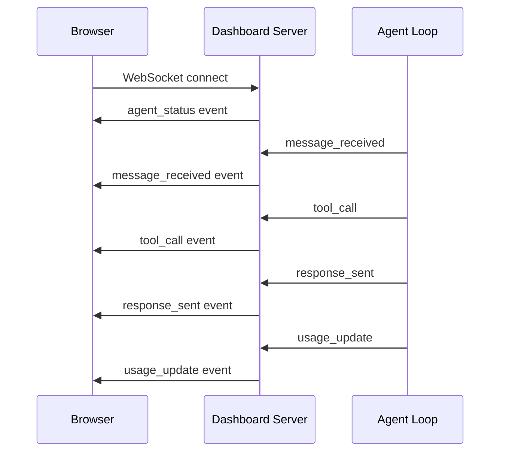

# Dashboard

Automate-E includes a built-in web dashboard for monitoring agent activity in real time.

## Features

| Feature | Description |
|---------|-------------|
| **Live messages** | See incoming Discord messages and agent responses as they happen |
| **Tool call log** | Track which tools the agent calls, with request/response details |
| **Token usage** | Monitor input/output tokens and estimated cost per message |
| **Memory stats** | View conversation count, fact count, and storage usage |
| **Agent status** | Connection state, uptime, and last activity timestamp |

## Access

The dashboard runs on port 3000 by default (configurable via `DASHBOARD_PORT`).

### Local Development

```bash
# Dashboard available at http://localhost:3000
npm start
```

### Kubernetes with Cloudflare Tunnel

In production, expose the dashboard via a Cloudflare Tunnel rather than a public LoadBalancer:

```bash
cloudflared tunnel --url http://book-e.ai-accountant.svc.cluster.local:3000
```

Or configure a persistent tunnel in Cloudflare Zero Trust to route a subdomain (e.g., `dashboard.example.com`) to the dashboard service.

## WebSocket Protocol

The dashboard uses WebSocket for real-time updates. The server pushes events to connected clients.



### Event Types

| Event | Payload | Description |
|-------|---------|-------------|
| `agent_status` | `{name, uptime, connected, lastActivity}` | Sent on connect |
| `message_received` | `{channel, user, content, timestamp}` | Incoming Discord message |
| `tool_call` | `{tool, method, path, status, duration}` | Tool HTTP call completed |
| `response_sent` | `{channel, content, tokens}` | Agent replied |
| `usage_update` | `{inputTokens, outputTokens, cost}` | Cumulative usage stats |

## Security

The dashboard has no built-in authentication. In production:

- Do not expose the dashboard port via a public Service or Ingress
- Use Cloudflare Tunnel with Cloudflare Access for authentication
- Or use `kubectl port-forward` for ad-hoc access:

```bash
kubectl port-forward -n ai-accountant deploy/book-e 3000:3000
```
