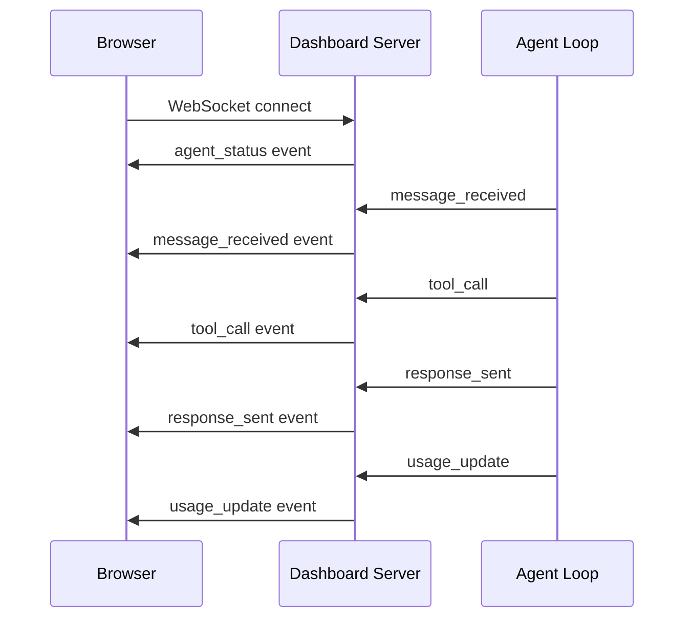

# Dashboard

Automate-E includes a built-in web dashboard for monitoring agent activity in real time.

## Features

| Feature | Description |
|---------|-------------|
| **Live messages** | See incoming Discord messages and agent responses as they happen |
| **Tool call log** | Track which tools the agent calls, with request/response details |
| **Token usage** | Monitor input/output tokens and estimated cost per message |
| **Memory stats** | View conversation count, fact count, and storage usage |
| **Agent status** | Connection state, uptime, and last activity timestamp |

## Access

The dashboard runs on port 3000 by default (configurable via `DASHBOARD_PORT`).

### Local Development

```bash
# Dashboard available at http://localhost:3000
npm start
```

### Production (Cloudflare Tunnel)

In production, expose the dashboard via a Cloudflare Tunnel. Enable the tunnel in Helm values:

```yaml
tunnel:
  enabled: true
  tokenSecretName: cloudflared-automate-e-token
  hostname: my-agent.example.com
```

This deploys a `cloudflared` sidecar container that routes traffic from the public hostname to the dashboard service inside the cluster. The tunnel token is stored as a Kubernetes secret created manually before deployment.

### Ad-hoc access via port-forward

```bash
kubectl port-forward -n automate-e deploy/my-agent 3000:3000
```

## WebSocket Protocol

The dashboard uses WebSocket for real-time updates. The server pushes events to connected clients.



### Event Types

| Event | Payload | Description |
|-------|---------|-------------|
| `agent_status` | `{name, uptime, connected, lastActivity}` | Sent on connect |
| `message_received` | `{channel, user, content, timestamp}` | Incoming Discord message |
| `tool_call` | `{tool, method, path, status, duration}` | Tool HTTP call completed |
| `response_sent` | `{channel, content, tokens}` | Agent replied |
| `usage_update` | `{inputTokens, outputTokens, cost}` | Cumulative usage stats |

## Security

The dashboard has no built-in authentication. In production:

- Use Cloudflare Tunnel with Cloudflare Access for authentication
- Do not expose the dashboard port via a public Service or Ingress
- The Helm chart's tunnel integration handles this automatically when enabled
