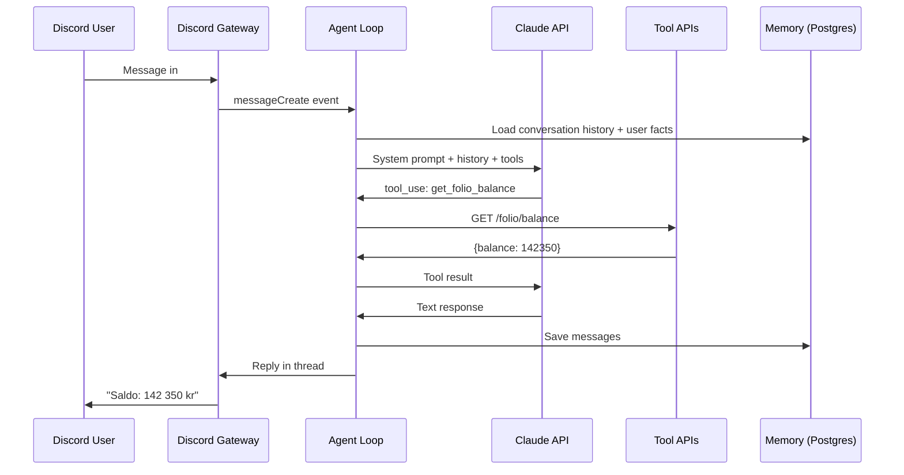

# Automate-E Runtime

Automate-E is a Kubernetes-native AI agent runtime for Discord. It turns a `character.json` config file into a running Discord bot backed by Claude, with persistent memory, tool calling, and cost tracking.

## Key Features

| Feature | Description |
|---------|-------------|
| **Character-driven** | Define personality, tools, and behavior in a single JSON file |
| **Claude-powered** | Agent loop uses Anthropic Claude API with tool use |
| **Postgres memory** | Conversations, user facts, and merchant patterns persist across restarts |
| **In-memory fallback** | Works without Postgres for local development |
| **Tool calling** | Agents call HTTP APIs defined in `character.json` |
| **Cost tracking** | Per-model token usage and cost calculation |
| **Live dashboard** | Real-time WebSocket dashboard for monitoring agent activity |
| **K8s-native** | Designed to run as a Deployment with ConfigMap-mounted character files |

## How It Works

## Repository

The runtime lives in [`Stig-Johnny/automate-e`](https://github.com/Stig-Johnny/automate-e) (private). Agent configurations (like Book-E) live in the consuming repo alongside their k8s manifests.

## Quick Links

- [Quick Start](quickstart.md) -- run an agent locally in 5 minutes
- [Configuration](configuration.md) -- full `character.json` reference
- [Architecture](architecture.md) -- how the runtime works internally
- [Deployment](deployment.md) -- deploy to Kubernetes
- [Book-E](agents/book-e.md) -- the first Automate-E agent
