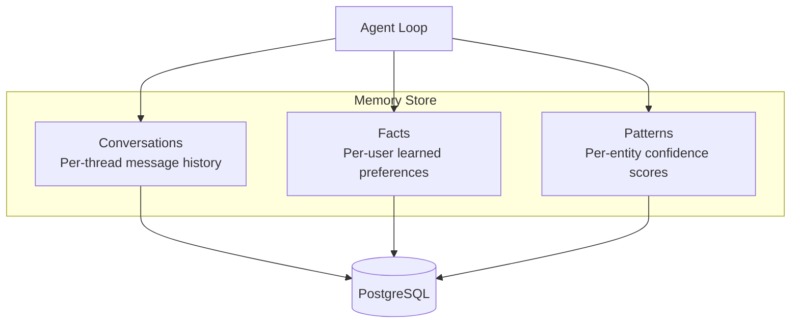

# Memory System

Automate-E agents have a three-layer memory system backed by PostgreSQL, with an in-memory fallback for development.

## Architecture



## Conversations

Message history stored per Discord thread. Used to build the conversation context sent to Claude.

| Column | Type | Description |
|--------|------|-------------|
| `thread_id` | string | Discord thread or channel ID |
| `role` | string | `user` or `assistant` |
| `content` | text | Message content |
| `timestamp` | timestamp | When the message was sent |
| `tokens` | integer | Token count for this message |

Conversations are loaded into the Claude prompt as message history. Older messages are trimmed to stay within the context window.

### Retention

Controlled by `memory.conversationRetention` in `character.json`. Default: `30d`. Messages older than the retention period are deleted on a periodic cleanup cycle.

## Facts

Per-user facts learned during conversations. These persist across threads and are injected into the system prompt when the user sends a message.

| Column | Type | Description |
|--------|------|-------------|
| `user_id` | string | Discord user ID |
| `fact` | text | A learned fact about the user |
| `source_thread` | string | Thread where the fact was learned |
| `created_at` | timestamp | When the fact was stored |

Example facts:

- "Prefers Norwegian language"
- "Is the CEO of Invotek AS"
- "Always wants receipts categorized under konto 6540 for software"

### Retention

Controlled by `memory.patternRetention`. Default: `indefinite`.

## Patterns

Entity-level patterns used for confidence scoring and auto-approval. In the accounting domain, these track merchant recognition.

| Column | Type | Description |
|--------|------|-------------|
| `entity_key` | string | Entity identifier (e.g., merchant name) |
| `pattern_type` | string | Pattern category (e.g., `merchant_category`) |
| `data` | jsonb | Pattern data (account, VAT rate, confidence) |
| `occurrences` | integer | How many times this pattern has been seen |
| `last_seen` | timestamp | Last occurrence |

Patterns are updated after each successful action. As `occurrences` increases, the confidence score rises, eventually enabling auto-approval.

## In-Memory Fallback

When `DATABASE_URL` is not set, the memory store uses JavaScript `Map` objects:

```
conversations: Map<threadId, Message[]>
facts: Map<userId, string[]>
patterns: Map<entityKey, Pattern>
```

This works for development and testing but data is lost on restart.

!!! warning
    In-memory mode is not suitable for production. Conversations and patterns will be lost when the pod restarts or is rescheduled.

## Postgres Setup

The `ai-accountant` namespace runs PostgreSQL as a StatefulSet:

```yaml
apiVersion: apps/v1
kind: StatefulSet
metadata:
  name: postgres
  namespace: ai-accountant
spec:
  replicas: 1
  template:
    spec:
      containers:
        - name: postgres
          image: postgres:16
          env:
            - name: POSTGRES_DB
              value: ai_accountant
```

The agent connects via `DATABASE_URL` and auto-creates tables on first run.
